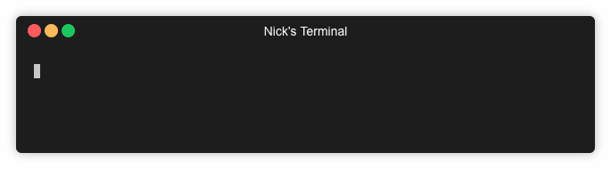
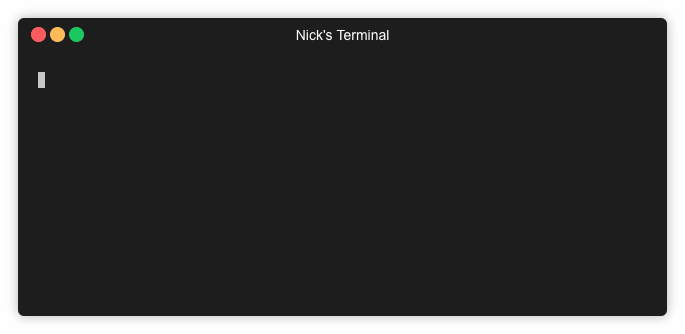
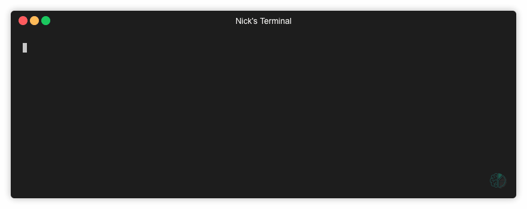

## 🧙😺 `magicat`
### _Deep learning magic.. with the convenience of `cat`!_

A Deep Learning powered CLI utility that brings computer vision to your command line!



At it's core, `magicat` is a tool that allows you to identify the objects contained in an image file. 

It does this by leveraging the power of the [MAX Image Segmenter model](https://developer.ibm.com/exchanges/models/all/max-image-segmenter/), one of the many free-to-use, open-source deep learning models available on [IBM's Model Asset eXchange](https://developer.ibm.com/code/exchanges/models/). The model has been converted to a TensorFlow.js implementation and the app runs entirely in Node.js.

In addition to displaying an image's contents, `magicat` has extended this functionality by offering several commands that allow you to search over directories with multiple images for certain objects, save individual objects as new image files, show in-terminal previews of objects, and more.

Keep reading for quick-and-easy install instructions, some information on the basic commands that are available and some GIFs to help you get started.

## Installation Instructions

Install using `npm` to automatically add the `magicat` command to your PATH.
```
$ npm install -g magicat
```

That's it! 

Now you can begin using `magicat` like your very own command-line crystal ball 🔮 to identify what objects are contained in an image.

## Basic Commands

> For more detailed usage information, see the in-app help page which can be accessed by executing `magicat -h`

Use the basic command `magicat <image_name>` to identify what objects are contained in an image. If you have multiple images you'd like to inspect, you can also provide the name of a directory containing image files.

To scan a directory of images for a certain object, use the `--contains` command. When used in combination with the `--verbose` option, the results for all images in a directory will be displayed. 




If you'd like to see an in-terminal preview of any of these objects, use the `--show` flag, followed by the name of the object you'd like to see. You can specify the 'colormap' to see all the objects highlighted within the original image.


_Object preview made possible thanks to @sindresorhus and [`terminal-image`](https://github.com/sindresorhus/terminal-image)_


To save any of the objects as individual image files, use the `--save` flag, followed by the name of the object you'd like to save, or use 'all' to save all objects.



## Licenses

| Component | License | Link  |
| ------------- | --------  | -------- |
| This repository | [Apache 2.0](https://www.apache.org/licenses/LICENSE-2.0) | [LICENSE](LICENSE) |
| Model Code (3rd party) | [Apache 2.0](https://www.apache.org/licenses/LICENSE-2.0) | [TensorFlow Models Repository](https://github.com/tensorflow/models/blob/master/LICENSE) |
| Model Weights | [Apache 2.0](https://www.apache.org/licenses/LICENSE-2.0) | [TensorFlow Models Repository](https://github.com/tensorflow/models/blob/master/LICENSE) |