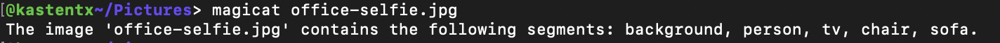
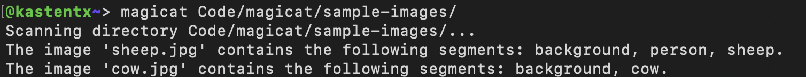
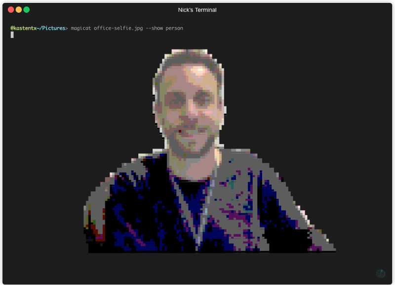
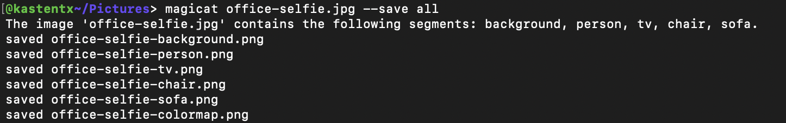

## 🧙😺 `magicat`
### _Deep learning magic.. with the convenience of `cat`!_

A Deep Learning powered CLI utility.

Install using `npm` to automatically add the `magicat` command to your PATH.

```
npm install -g magicat
```

That's it! 

Now you can begin using the `magicat` command like your very own command-line crystal ball 🔮 to identify what objects are contained in an image.



If you have multiple images you'd like to inspect, you can also specify the name of a directory containing image files.



If you'd like to see an in-terminal preview of any of these objects, use the `--show` flag, followed by the name of the object you'd like to see. You can specify the 'colormap' to see all the objects highlighted within the original image.


_Object preview made possible thanks to @sindresorhus and [`terminal-image`](https://github.com/sindresorhus/terminal-image)_

To save any of the objects as individual image files, use the `--save` flag, followed by the name of the object you'd like to save, or use 'all' to save all objects.


