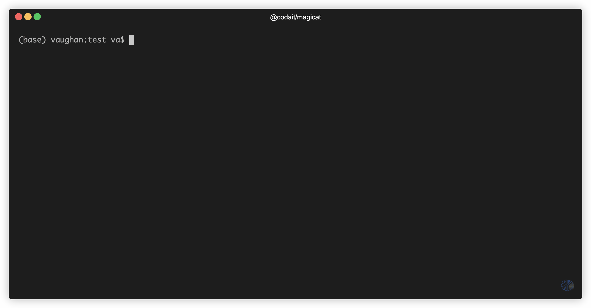

## 🧙😺 `magicat`
### _Deep learning magic... with the convenience of `cat`!_

A Deep Learning powered CLI utility that brings computer vision to your command line!


At it's core, `magicat` is a tool that allows you to identify the objects contained in an image file. 

It does this by leveraging the power of the [`@codait/max-image-segmenter`](https://github.com/CODAIT/max-tfjs-models/tree/master/image-segmenter#readme), which is a [TensorFlow.js](https://www.tensorflow.org/js) port of the [MAX Image Segmenter](https://developer.ibm.com/exchanges/models/all/max-image-segmenter/) pre-trained model. The MAX Image Segmenter is one of the many free-to-use, open-source deep learning models available on [IBM's Model Asset eXchange](https://developer.ibm.com/exchanges/models/all/).

In addition to displaying an image's contents, `magicat` has extended this functionality by offering several commands that allow you to search over directories with multiple images for certain objects, save individual objects as new image files, show in-terminal previews of objects, and more.

Keep reading for quick-and-easy install instructions, some information on the basic commands that are available, and some GIFs to help you get started.

### Prerequisites

- Node.js v10.x or higher

## Installation Instructions

Install using `npm` to automatically add the `magicat` command to your PATH.
```
$ npm install -g @codait/magicat
```

That's it! 

Now you can begin using `magicat` like your very own command-line crystal ball 🔮 to identify what objects are contained in an image.

## Basic Commands

> For more detailed usage information, see the in-app **help page** which can be accessed by executing `magicat -h`

Use the basic command 

```
$ magicat <file|directory|url>
```
to **identify** what objects are contained in an image. If you have multiple images you'd like to inspect, you can provide the path to a directory containing image files. In addition, you may also provide a URL to an image.

To **scan a directory** of images for a certain object, use the `--contains` option.


If you'd like to see an in-terminal **preview** of any of these objects, use the `--preview` flag, followed by the name of the object you'd like to see.



> _Object preview made possible thanks to @sindresorhus and [`terminal-image`](https://github.com/sindresorhus/terminal-image)_


To **save** any of the objects as individual image files, use the `--save` flag, followed by the name of the object you'd like to save, or leave the name blank to save all objects.


> By default, the individual image files are saved in the same directory as the source image (or current working directory for image URLs). To specify a different directory to save files use the `--output` flag.

To **remove** an object or background from an image, use the `--remove` flag, followed by the name of the object you'd like to remove or the shorthand aliases `bg` to remove the background. A copy of the image is saved with the specified object removed.


> By default, the individual image files are saved in the same directory as the source image (or current working directory for image URLs). To specify a different directory to save files use the `--output` flag.

## Licenses

| Component | License | Link  |
| ------------- | --------  | -------- |
| This repository | [Apache 2.0](https://www.apache.org/licenses/LICENSE-2.0) | [LICENSE](LICENSE) |
| Model Code (3rd party) | [Apache 2.0](https://www.apache.org/licenses/LICENSE-2.0) | [TensorFlow Models Repository](https://github.com/tensorflow/models/blob/master/LICENSE) |
| Model Weights | [Apache 2.0](https://www.apache.org/licenses/LICENSE-2.0) | [TensorFlow Models Repository](https://github.com/tensorflow/models/blob/master/LICENSE) |
